# VoiceChat

A self-hosted voice and text chat platform for gaming communities.

<!-- CI badge: configure after GitHub Actions setup -->
<!--  -->

## Features

- **Low Latency Voice Chat** – WebRTC-based with Opus codec, optimized for gaming
- **End-to-End Encryption** – Text messages encrypted with Olm/Megolm
- **Self-Hosted** – Your data stays on your server
- **Lightweight Client** – Tauri-based desktop app with minimal resource usage
- **SSO Support** – Integrate with Authentik, Keycloak, Azure AD, and more
- **Open Source** – MIT/Apache-2.0 dual licensed

## Architecture

### System Overview

### Authentication Flow

#### Local Authentication (Username + Password)

#### SSO / OIDC Authentication

```mermaid
sequenceDiagram
    participant C as Client (Tauri)
    participant B as System Browser
    participant S as Server
    participant R as Redis
    participant IDP as Identity Provider

    C->>S: GET /auth/oidc/providers
    S-->>C: [{slug, display_name, icon_hint}]

    C->>C: Bind TCP on 127.0.0.1:{random_port}
    C->>S: GET /auth/oidc/authorize/{slug}?redirect_uri=http://127.0.0.1:{port}/callback

    S->>S: Generate PKCE (S256), state (32B), nonce
    S->>S: Encrypt flow state (AES-256-GCM)
    S->>R: SET oidc:state:{sha256(state)} = encrypted_flow (TTL 600s)
    S-->>C: 302 → IDP authorize URL

    C->>B: Open redirect URL in browser
    B->>IDP: User authenticates + consents
    IDP-->>B: 302 → /auth/oidc/callback?code=...&state=...

    B->>S: GET /auth/oidc/callback?code=...&state=...
    S->>R: GETDEL oidc:state:{sha256(state)}
    S->>S: Decrypt + verify flow state
    S->>IDP: POST token endpoint {code, PKCE verifier}
    IDP-->>S: {access_token, id_token}
    S->>S: Verify ID token (signature + nonce)
    S->>IDP: GET userinfo endpoint
    IDP-->>S: {sub, email, name, preferred_username}

    S->>S: Resolve user (external_id = slug:subject)
    alt New User
        S->>S: Generate username from claims
        S->>S: Create user in transaction (first-user → admin)
    end
    S->>S: Issue JWT + session
    S-->>B: 302 → http://127.0.0.1:{port}/callback?access_token=...

    B->>C: TCP callback with tokens
    C->>C: Store tokens, init WebSocket
```

### Voice & WebRTC Flow

#### Joining a Voice Channel

#### SFU Track Routing

```mermaid
graph LR
    subgraph Room["Voice Room (Channel)"]
        subgraph PeerA["Peer A"]
            A_Mic["🎤 Mic Track"]
            A_Screen["🖥️ Screen Track"]
        end
        subgraph PeerB["Peer B"]
            B_Mic["🎤 Mic Track"]
        end
        subgraph PeerC["Peer C"]
            C_Mic["🎤 Mic Track"]
        end

        subgraph TrackRouter["Track Router (SFU)"]
            Router_Core["Selective<br/>Forwarding"]
        end

        A_Mic -->|RTP| Router_Core
        A_Screen -->|RTP| Router_Core
        B_Mic -->|RTP| Router_Core
        C_Mic -->|RTP| Router_Core

        Router_Core -->|"A's audio + screen"| PeerB
        Router_Core -->|"A's audio + screen"| PeerC
        Router_Core -->|"B's audio"| PeerA
        Router_Core -->|"B's audio"| PeerC
        Router_Core -->|"C's audio"| PeerA
        Router_Core -->|"C's audio"| PeerB
    end
```

#### DM Voice Calls (Event-Sourced)

### Chat Message Flow

### End-to-End Encryption (E2EE)

#### Key Distribution (Olm/Megolm via vodozemac)

#### Encryption Layers

### Permission System

### Real-Time Communication

### Client Architecture

### Data Layer

### Request Lifecycle

## Documentation

All documentation is located in the [`docs/`](docs/) directory.

### Getting Started
- [System Dependencies](docs/getting-started/dependencies.md)
- [Development Setup](docs/development/setup.md)

### Operations
- [Configuration Guide](docs/ops/configuration.md)
- [Deployment Guide](docs/ops/deployment.md)

### Architecture & Security
- [Architecture Overview](docs/architecture/overview.md)
- [Encryption Architecture](docs/security/encryption.md)

### Project
- [Roadmap](docs/project/roadmap.md)
- [Design Guidelines](docs/design/ux-guidelines.md)

## License

Licensed under either of

- Apache License, Version 2.0 ([LICENSE-APACHE](LICENSE-APACHE) or http://www.apache.org/licenses/LICENSE-2.0)
- MIT license ([LICENSE-MIT](LICENSE-MIT) or http://opensource.org/licenses/MIT)

at your option.

## Contribution

Unless you explicitly state otherwise, any contribution intentionally submitted for inclusion in the work by you, as defined in the Apache-2.0 license, shall be dual licensed as above, without any additional terms or conditions.
