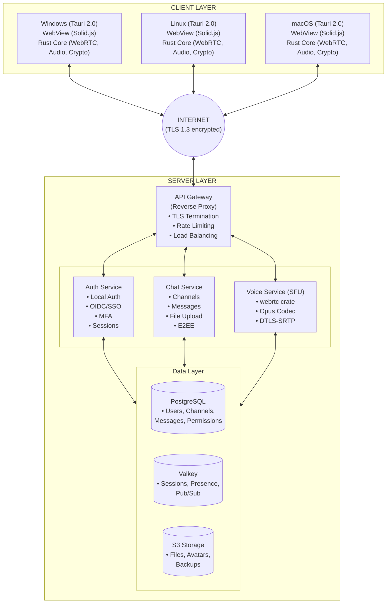
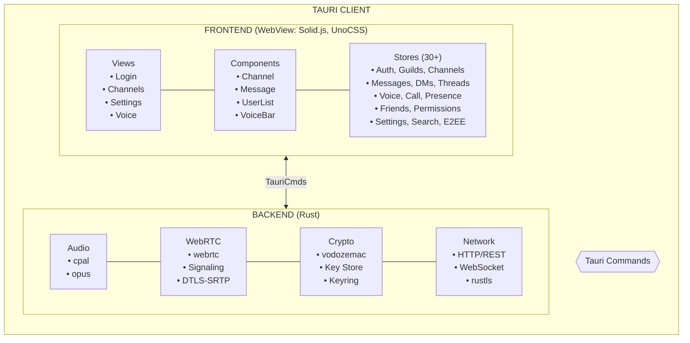
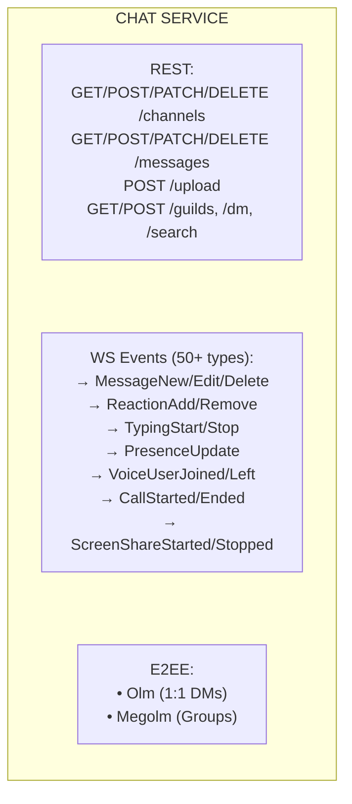
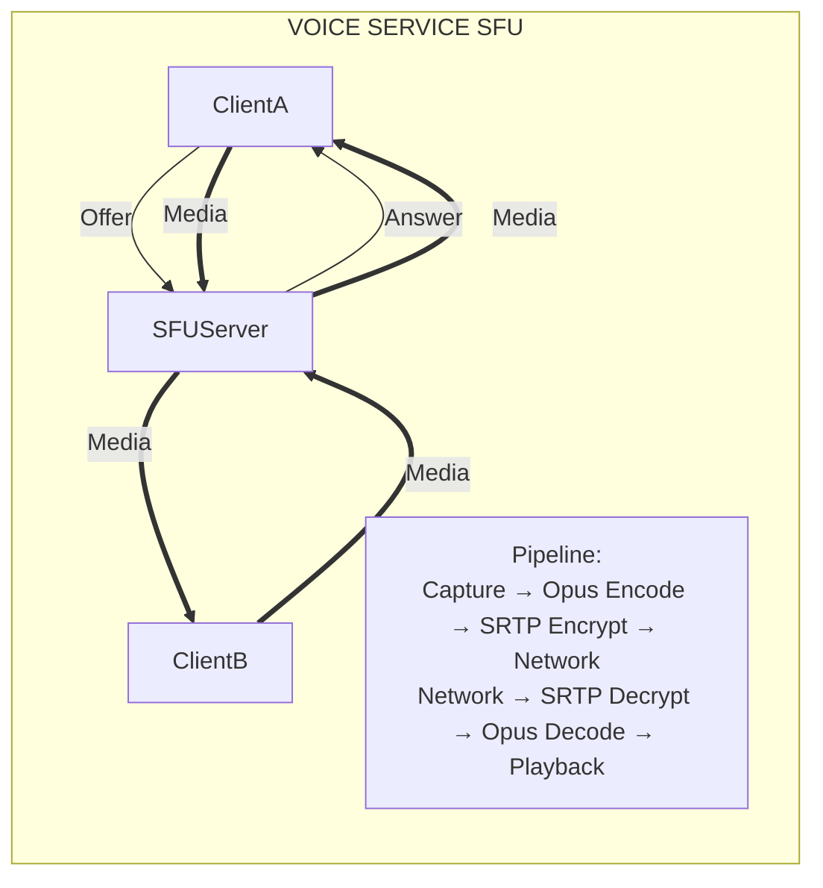
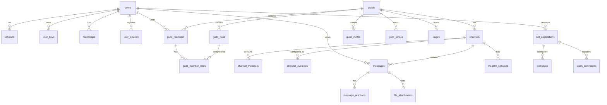
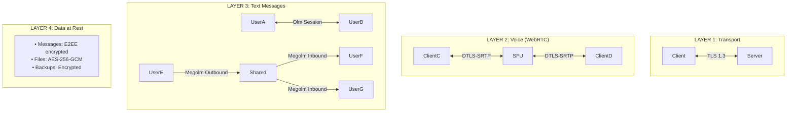
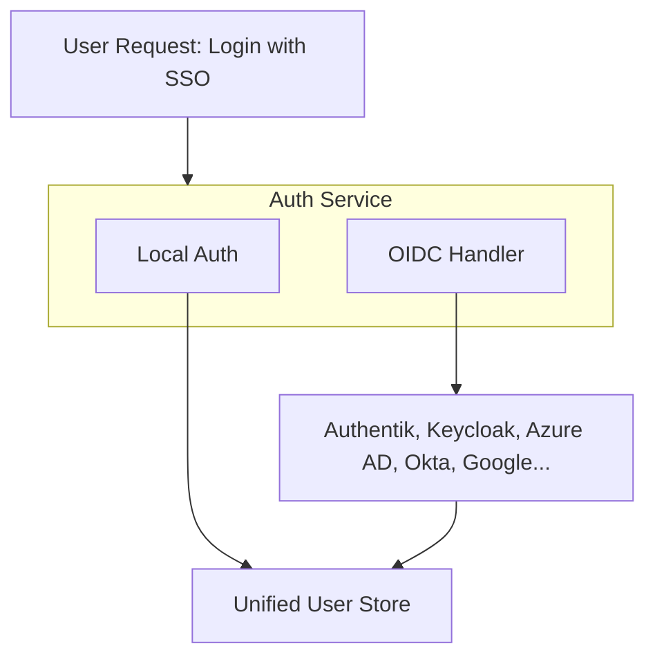
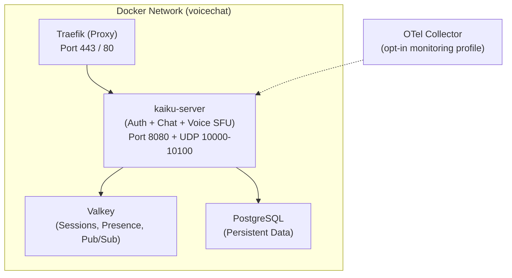
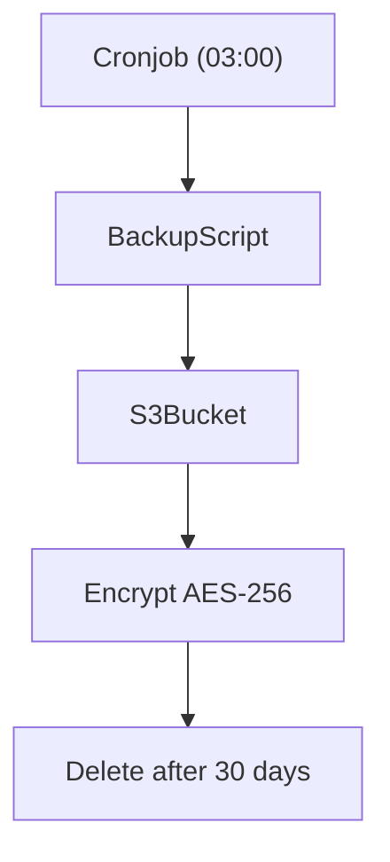

# Kaiku Platform - Technical Architecture

## Architecture Overview



---

## Component Details

### 1. Client Architecture (Tauri 2.0)



#### Client Resource Targets

| Metric | Target | Discord for Comparison |
|--------|--------|------------------------|
| RAM (Idle) | <80 MB | ~300-400 MB |
| RAM (Voice active) | <120 MB | ~400-500 MB |
| CPU (Idle) | <1% | ~2-5% |
| CPU (Voice active) | <5% | ~5-10% |
| Binary Size | <50 MB | ~150 MB |
| Startup | <3s | ~5-10s |

---

### 2. Server Architecture

#### Auth Service

```
┌──────────────────────────────────────────────────────────────────────┐
│                          AUTH SERVICE                                 │
├──────────────────────────────────────────────────────────────────────┤
│                                                                       │
│  Public Endpoints:                                                    │
│  ─────────────────                                                    │
│  POST   /auth/register                Local user registration         │
│  POST   /auth/login                   Login (local + MFA)             │
│  POST   /auth/refresh                 Renew access token              │
│  GET    /auth/oidc/providers          List configured SSO providers   │
│  GET    /auth/oidc/authorize/{prov}   Start SSO flow                  │
│  GET    /auth/oidc/callback           SSO callback handler            │
│  POST   /auth/forgot-password         Request password reset          │
│  POST   /auth/reset-password          Complete password reset         │
│                                                                       │
│  Protected Endpoints (require JWT):                                   │
│  ──────────────────────────────────                                   │
│  POST   /auth/logout                  End session                     │
│  GET    /auth/me                      Get user profile                │
│  POST   /auth/me                      Update profile                  │
│  POST   /auth/me/password             Change password                 │
│  POST   /auth/me/avatar               Upload avatar                   │
│  POST   /auth/mfa/setup               TOTP setup                      │
│  POST   /auth/mfa/verify              TOTP verification               │
│  POST   /auth/mfa/disable             Disable MFA                     │
│  POST   /auth/mfa/backup-codes        Generate recovery codes         │
│  GET    /auth/mfa/backup-codes/count  Remaining code count            │
│                                                                       │
│  Internal Functions:                                                  │
│  ───────────────────                                                  │
│  • Password Hashing (Argon2id)                                        │
│  • JWT Generation/Validation (EdDSA/RS256)                            │
│  • Session Management (Valkey)                                        │
│  • OIDC Provider Integration (JIT Provisioning)                       │
│  • MFA: TOTP + Backup Codes (Argon2id hashed)                        │
│                                                                       │
│  Token Strategy:                                                      │
│  ────────────────                                                     │
│  • Access Token:  JWT, 15 min validity                                │
│  • Refresh Token: Opaque, 7 days, in Valkey                           │
│  • Session:       Valkey with user metadata                           │
│                                                                       │
└──────────────────────────────────────────────────────────────────────┘
```

#### Chat Service



#### Voice Service (SFU)



---

### 3. Database Schema (Overview)



> **Note:** This is a simplified overview. The full schema has 70+ tables including
> telemetry, moderation, workspaces, DM state, admin/audit, and more.
> See `server/migrations/` for the authoritative schema.

---

### 4. Encryption Architecture



---

### 5. SSO/Identity Architecture



---

### 6. Deployment Architecture



---

### 7. Backup & Recovery



---

## Future: Kubernetes Scalability

*Status: Planning required before implementation*

For future K8s deployments requiring horizontal scaling, the current Valkey-based pub/sub architecture may need enhancement. Key considerations:

### Current Limitations for Multi-Pod Deployments
- Valkey pub/sub requires all pods to connect to the same instance
- No built-in message persistence for pod restarts
- Rate limiting state is centralized

### Potential Solutions (Requires Architecture Design)
- **NATS**: Sub-millisecond latency, Apache-2.0 licensed, excellent K8s operator support
- **Valkey Cluster**: Horizontal scaling with same API, but more operational complexity
- **Hybrid approach**: NATS for real-time pub/sub, Valkey for rate limiting and caching

### Design Principles to Preserve
- <50ms voice latency target
- Graceful degradation (fail-open for non-critical paths)
- Event sourcing patterns (call state reconstruction)

**Note**: This is documented for future planning. Current single-server and simple multi-server deployments work well with Valkey.

---

## References

- [PROJECT_SPEC.md](../project/specification.md) - Project Requirements
- [STANDARDS.md](../development/standards.md) - Standards Used
- [LICENSE_COMPLIANCE.md](../../../LICENSE_COMPLIANCE.md) - License Review
