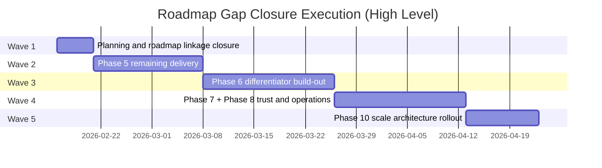
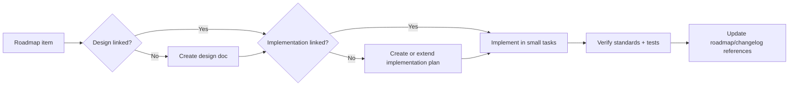

# Roadmap Gap Closure - Implementation Plan

> **For Claude:** REQUIRED SUB-SKILL: Use superpowers:executing-plans to implement this plan task-by-task.

**Goal:** close roadmap coverage gaps for items that currently have no linked design and/or no linked implementation plan, while implementing features with open standards whenever possible.

**Architecture:** deliver in five waves: (1) planning/linkage closure, (2) Phase 5 remaining feature completion, (3) Phase 6 differentiators, (4) Phase 7/8 trust-and-operations execution, (5) Phase 10 scale architecture. Each wave must satisfy standards, tests, and release gates before moving forward.

**Tech Stack:** Rust (`axum`, `sqlx`, `tokio`, `tracing`), Solid.js + Tauri, PostgreSQL, Valkey, S3-compatible object storage, CDN, GitHub Actions, Docker, OpenTelemetry.

---

## 1) Scope and Gap Inventory

This plan covers roadmap checklist items in `docs/project/roadmap.md` that are missing inline design and/or implementation references, with priority on open/in-progress work in Phases 5, 6, 7, 8, and 10.

### Priority targets

1. **Phase 5 remaining open items** (monetization, moderation filters, webhooks/gateway expansion, discovery/onboarding, search tech debt, governance, media processing, thread toggle, str0m evaluation decision record).
2. **Phase 6 planned differentiators** (mobile, workspaces, sovereign guild model, live session toolkit, focus engine, digital library).
3. **Phase 7 planned SaaS polish** (billing, accessibility, identity trust, observability).
4. **Phase 8 planned reliability/operability track** (designs exist, implementation linkage missing).
5. **Phase 10 storage scaling architecture** (signed URLs/cookies, CDN integration).

---

## 2) Open Standards Baseline (Mandatory)

Use these standards unless there is a documented technical reason not to:

| Domain | Required standards/profile |
|---|---|
| Auth and identity | OAuth 2.1 profile + OpenID Connect, JWT (RFC 7519), Argon2id |
| Realtime transport | WebSocket (RFC 6455), TLS 1.3 |
| Voice/media | WebRTC (ICE/STUN/TURN, RTP/RTCP), SDP interop |
| Telemetry | OpenTelemetry + OTLP, W3C Trace Context |
| API contracts | OpenAPI 3.1 for HTTP endpoints and schemas |
| Webhooks/events | CloudEvents 1.0 envelope + HMAC SHA-256 signatures |
| Accessibility | WCAG 2.2 AA + WAI-ARIA patterns |
| Storage delivery | S3 API compatibility + SigV4 style signing, HTTP caching semantics |
| Data export | JSON/ZIP structured export with stable schema/version fields |

### Standards gate rule

Every feature PR in this program must include a short "standards compliance" note in its plan/checklist (what standard is used, where it is enforced, and test coverage proving conformance).

---

## 3) Execution Waves





---

## 4) Workstreams and Deliverables

## WS-A: Roadmap Linkage and Planning Closure

### Deliverables
- Canonical mapping of roadmap items -> design docs -> implementation docs.
- Inline roadmap links added for missing implementation references (at least phase-level; item-level where practical).
- Execution backlog grouped by phase and owner.

### Primary targets
- `docs/project/roadmap.md`
- `docs/plans/PLAN_LIFECYCLE.md`
- `scripts/check_docs_governance.py`

## WS-B: Phase 5 Remaining Completion

### Deliverables
- Complete remaining Phase 5 open items with test coverage.
- Formal decision record for `str0m` evaluation trigger criteria and migration conditions.
- Close thread guild-toggle and media-processing gaps.

### Primary targets
- `server/src/chat/`
- `server/src/moderation/`
- `server/src/ws/bot_gateway.rs`
- `server/src/guild/`
- `server/src/voice/`
- `server/tests/`
- `client/src/components/messages/`
- `client/src/views/`

## WS-C: Phase 6 Differentiators

### Deliverables
- Mobile execution strategy finalized and scaffolded.
- Workspaces, sovereign guild controls, and live-session tools implemented behind flags.
- Focus engine and digital library MVP delivered.

### Primary targets
- `client/src/views/`
- `client/src/components/`
- `server/src/guild/`
- `server/src/auth/`
- `server/src/voice/`
- `server/src/ws/`

## WS-D: Phase 7 and 8 Trust/Operations

### Deliverables
- Billing, accessibility, identity trust, observability foundation.
- Full Phase 8 implementation coverage linked from roadmap items.

### Primary targets
- `server/src/auth/`
- `server/src/api/`
- `client/src/views/settings/`
- `infra/monitoring/`
- `.github/workflows/`
- `docs/ops/`, `docs/security/`, `docs/compliance/`

## WS-E: Phase 10 Scale

### Deliverables
- Signed URL/cookie architecture, CDN integration, and rollout playbook.
- Performance/cost/SLA validation for storage and media delivery.

### Primary targets
- `server/src/chat/uploads.rs`
- `server/src/chat/s3.rs`
- `server/src/config.rs`
- `server/tests/uploads_http_test.rs`
- `docs/ops/`

---

## 5) Detailed Task Backlog

### Task 1: Build roadmap coverage matrix

**Files:**
- Create: `docs/project/roadmap-coverage-matrix.md`
- Modify: `docs/project/roadmap.md`

1. Inventory all open checklist items in phases 5/6/7/8/10.
2. Mark each item as `design-linked`, `impl-linked`, or `missing`.
3. Add roadmap references to this implementation plan for uncovered items.
4. Validate links with `python3 scripts/check_docs_governance.py`.
5. Commit.

### Task 2: Standards profile and enforcement checklist

**Files:**
- Create: `docs/standards/open-standards-profile.md`
- Create: `docs/standards/feature-standards-checklist.md`

1. Define required standards by domain (auth, realtime, media, telemetry, a11y).
2. Add "must-pass" standards checklist template for feature plans.
3. Link checklist from roadmap gap matrix.
4. Add CI check for template presence in new plan docs.
5. Commit.

### Task 3: Phase 5 str0m decision record

**Files:**
- Create: `docs/plans/2026-02-15-str0m-evaluation-decision-record.md`
- Modify: `docs/project/roadmap.md`

1. Define objective trigger conditions from roadmap (security/perf/architecture).
2. Specify comparison criteria against `webrtc-rs`.
3. Define go/no-go thresholds and rollback plan.
4. Link decision record from roadmap item.
5. Commit.

### Task 4: Limits and monetization implementation slice

**Files:**
- Modify: `server/src/guild/`
- Modify: `server/src/auth/`
- Modify: `client/src/views/settings/`
- Test: `server/tests/`

1. Add failing tests for guild limits and boost entitlement checks.
2. Implement server-side quota enforcement and clear error codes.
3. Add client visibility for usage and limit status.
4. Re-run integration tests and update docs.
5. Commit.

### Task 5: Advanced moderation filters implementation slice

**Files:**
- Modify: `server/src/moderation/handlers.rs`
- Modify: `server/src/moderation/types.rs`
- Modify: `client/src/views/settings/`
- Test: `server/tests/moderation_http_test.rs`

1. Add failing tests for filter policy actions and false-positive overrides.
2. Implement configurable filter categories and action matrix.
3. Add safety policy UI controls in guild settings.
4. Add audit events and moderation logs.
5. Commit.

### Task 6: Webhooks and bot gateway expansion

**Files:**
- Modify: `server/src/ws/bot_gateway.rs`
- Modify: `server/src/api/`
- Create: `docs/development/webhooks.md`
- Test: `server/tests/`

1. Add CloudEvents envelope and signature verification tests.
2. Implement webhook retry queue with backoff and dead-letter handling.
3. Extend gateway intents and bot-specific rate limits.
4. Add guild-level webhook management UI hooks.
5. Commit.

### Task 7: Discovery/onboarding and production polish bundle

**Files:**
- Modify: `client/src/views/Main.tsx`
- Create: `client/src/views/DiscoveryView.tsx`
- Create: `client/src/components/onboarding/OnboardingOverlay.tsx`
- Modify: `client/src/components/messages/MessageList.tsx`

1. Add discovery API integration and first-time onboarding flow.
2. Implement message-list virtualization with stable scroll behavior.
3. Add global toast provider and action-capable notifications.
4. Add E2E coverage for onboarding and discovery flows.
5. Commit.

### Task 8: Search debt, bulk-read management, and thread toggle

**Files:**
- Modify: `server/src/chat/`
- Modify: `server/src/guild/`
- Modify: `client/src/components/messages/`
- Test: `server/tests/search_http_test.rs`

1. Add failing tests for channel-level permission filtering and abuse cases.
2. Implement search permission boundary fixes and analytics logging.
3. Implement bulk "mark read" endpoints and client actions.
4. Add guild-level threads enable/disable toggle.
5. Commit.

### Task 9: Compliance trust and account lifecycle

**Files:**
- Modify: `server/src/auth/`
- Modify: `server/src/chat/uploads.rs`
- Create: `docs/compliance/data-export-contract.md`
- Test: `server/tests/auth_test.rs`

1. Add export/erasure workflow tests (authorization + lifecycle states).
2. Implement export job queue and delivery contract.
3. Implement soft-delete/hard-delete lifecycle with grace-period policy.
4. Add abuse protection and per-guild safeguards.
5. Commit.

### Task 10: Media processing completion

**Files:**
- Modify: `server/src/chat/uploads.rs`
- Modify: `server/src/chat/s3.rs`
- Modify: `client/src/components/messages/MessageItem.tsx`
- Test: `server/tests/uploads_http_test.rs`

1. Add failing tests for thumbnail/blurhash metadata generation.
2. Implement async generation pipeline and metadata persistence.
3. Implement progressive client loading (placeholder -> thumbnail -> full).
4. Add viewport-aware image loading behavior.
5. Commit.

### Task 11: Phase 6 mobile + workspace foundations

**Files:**
- Create: `docs/plans/2026-02-15-phase-6-mobile-workspaces-design.md`
- Create: `docs/plans/2026-02-15-phase-6-mobile-workspaces-implementation.md`
- Modify: `docs/project/roadmap.md`

1. Define architecture decision for Tauri mobile vs native bridge.
2. Define workspace domain model and sync protocol.
3. Create implementation plan with phased delivery and tests.
4. Link both docs from roadmap Phase 6 items.
5. Commit.

### Task 12: Phase 6 sovereign guild and live toolkit foundations

**Files:**
- Create: `docs/plans/2026-02-15-phase-6-sovereign-livekit-design.md`
- Create: `docs/plans/2026-02-15-phase-6-sovereign-livekit-implementation.md`
- Modify: `docs/project/roadmap.md`

1. Define BYO S3 and SFU relay capability/validation model.
2. Define live toolkit primitives and permission controls.
3. Add implementation milestones and rollout flags.
4. Link docs from roadmap items.
5. Commit.

### Task 13: Phase 6 focus engine and digital library foundations

**Files:**
- Create: `docs/plans/2026-02-15-phase-6-focus-library-design.md`
- Create: `docs/plans/2026-02-15-phase-6-focus-library-implementation.md`
- Modify: `docs/project/roadmap.md`

1. Define foreground-app integration safety/privacy model.
2. Define library document model (versioning, deep links, restore).
3. Create implementation sequence and tests.
4. Link docs from roadmap.
5. Commit.

### Task 14: Phase 7 billing and identity trust planning closure

**Files:**
- Create: `docs/plans/2026-02-15-phase-7-billing-identity-design.md`
- Create: `docs/plans/2026-02-15-phase-7-billing-identity-implementation.md`
- Modify: `docs/project/roadmap.md`

1. Define billing boundaries, entitlement contracts, and webhook handling.
2. Define identity linking and verification trust policy.
3. Create implementation timeline and migration plan.
4. Link docs from roadmap.
5. Commit.

### Task 15: Phase 7 accessibility and observability planning closure

**Files:**
- Create: `docs/plans/2026-02-15-phase-7-a11y-observability-design.md`
- Create: `docs/plans/2026-02-15-phase-7-a11y-observability-implementation.md`
- Modify: `docs/project/roadmap.md`

1. Define WCAG 2.2 AA target matrix and test strategy.
2. Define observability stack implementation milestones using OTel profile.
3. Create implementation timeline with acceptance criteria.
4. Link docs from roadmap.
5. Commit.

### Task 16: Phase 8 implementation consolidation

**Files:**
- Create: `docs/plans/2026-02-15-phase-8-reliability-implementation.md`
- Modify: `docs/project/roadmap.md`

1. Aggregate the 8 Phase 8 design docs into one execution plan.
2. Define dependency graph and rollout order.
3. Add Implementation links to each Phase 8 roadmap item.
4. Add CI verification hooks for phase-level deliverables.
5. Commit.

### Task 17: Phase 10 storage scaling design + implementation closure

**Files:**
- Create: `docs/plans/2026-02-15-phase-10-storage-scaling-design.md`
- Create: `docs/plans/2026-02-15-phase-10-storage-scaling-implementation.md`
- Modify: `docs/project/roadmap.md`

1. Define signed URL/cookie architecture and CDN policy profile.
2. Define migration and compatibility path from proxy-based delivery.
3. Create implementation phases with verification checkpoints.
4. Link docs from roadmap Phase 10 item.
5. Commit.

### Task 18: Standards compliance verification automation

**Files:**
- Modify: `scripts/check_docs_governance.py`
- Modify: `.github/workflows/ci.yml`

1. Add checks that each new phase item has linked design + implementation docs.
2. Add checks that new phase plans include a standards compliance section.
3. Enforce these checks in CI docs-governance job.
4. Run local validation and fix failures.
5. Commit.

---

## 6) Verification Commands

Run after each implementation slice:

```bash
python3 scripts/check_docs_governance.py
cargo test
cargo fmt --check && cargo clippy --all-targets --all-features -- -D warnings
cargo deny check licenses
cd client && bun run test:run && bun run build
```

For telemetry/operability slices (when applicable):

```bash
python3 scripts/generate_release_notes.py --version v0.0.0-plan-check --output /tmp/release-notes.md
```

---

## 7) Definition of Done

The roadmap gap closure program is complete when all conditions hold:

1. All open roadmap items in phases 5/6/7/8/10 have linked implementation plans.
2. Items lacking design docs now have linked design docs.
3. All new plans include open-standards compliance sections.
4. CI enforces roadmap/doc linkage and standards-plan checks.
5. Implementation work for remaining Phase 5 items has test coverage and roadmap status updates.

---

## 8) Initial Priority Order

1. WS-A roadmap closure and standards profile.
2. WS-B Phase 5 remaining delivery (fastest user-facing and debt payoff).
3. WS-D Phase 8 implementation consolidation.
4. WS-C and WS-D Phase 6/7 planning and staged implementation.
5. WS-E Phase 10 storage scaling finalization.
