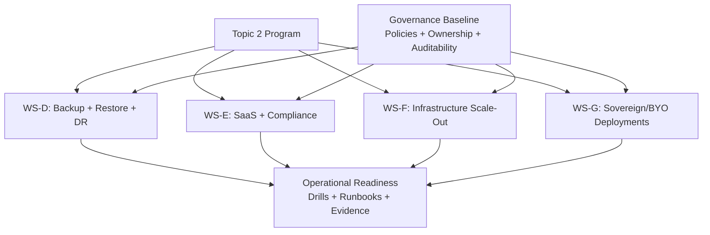
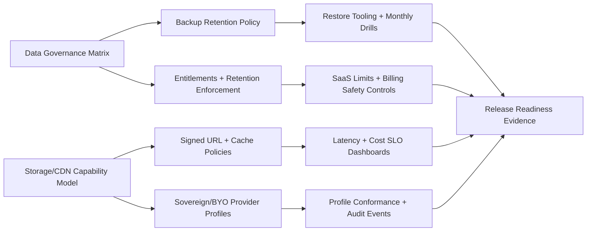
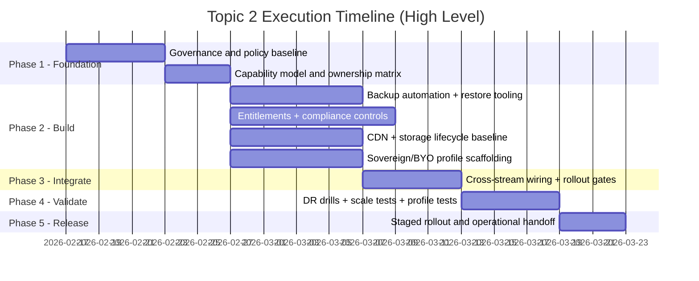

# Topic 2 Expansion and Trust Implementation Plan

> **For Claude:** REQUIRED SUB-SKILL: Use superpowers:executing-plans to implement this plan task-by-task.

**Goal:** Deliver Topic 2 as one coordinated program: backup/restore/DR, SaaS+compliance baseline, media infrastructure scale-out, and sovereign/BYO deployment capabilities.

**Architecture:** Implement Topic 2 as four parallel workstreams with explicit dependency gates. Start with governance and safety controls (data lifecycle, backup policy, provider capability model), then roll out product and infrastructure changes behind controlled release gates. Finish with drills and conformance validation so each stream is operationally testable before broad rollout.

**Tech Stack:** Rust (`axum`, `sqlx`, `tokio`), Solid.js/Tauri client, PostgreSQL, Valkey, object storage, CDN, GitHub Actions, Docker, Markdown, Mermaid.

---

## Design References

- `docs/plans/2026-02-15-backup-restore-drills-design.md`
- `docs/plans/2026-02-15-saas-compliance-readiness-design.md`
- `docs/plans/2026-02-15-infrastructure-scale-out-design.md`
- `docs/plans/2026-02-15-sovereign-byo-deployment-design.md`

---

## Program Topology



---

## Dependency Flow



---

## Delivery Phases



---

## Workstream Details

## WS-D: Backup, Restore, and DR

**Primary outcomes**
- Classified data assets with RPO/RTO targets.
- Automated backups (DB/object/key material) with integrity verification.
- One-command staging restore and monthly drill cadence.

**Planned file targets**
- Create: `infra/backup/pg-backup.sh`
- Create: `infra/backup/object-backup.sh`
- Create: `infra/backup/key-backup.sh`
- Create: `infra/backup/restore-staging.sh`
- Create: `docs/ops/backup-policy.md`
- Create: `docs/ops/disaster-recovery-runbook.md`
- Create: `docs/ops/restore-drill-template.md`
- Modify: `.github/workflows/security.yml`

**Acceptance checks**
- Backup job telemetry and alerting enabled.
- Restore succeeds in staging with integrity checks.
- Drill evidence is stored and auditable.

---

## WS-E: SaaS and Compliance Baseline

**Primary outcomes**
- Server-enforced entitlement model for limits/quotas.
- Data lifecycle controls (retention, export, deletion).
- Accessibility baseline for critical UX paths.
- Identity trust safeguards for linking and recovery.

**Planned file targets**
- Create: `docs/compliance/data-lifecycle-matrix.md`
- Create: `docs/compliance/accessibility-baseline.md`
- Create: `docs/compliance/identity-trust-policy.md`
- Modify: `server/src/auth/`
- Modify: `server/src/api/`
- Modify: `client/src/pages/`
- Modify: `client/src/components/`
- Test: `server/tests/upload_limits_test.rs`
- Test: `server/tests/auth_test.rs`

**Acceptance checks**
- Limit checks enforced server-side for protected paths.
- Export/deletion paths require strict authorization.
- Accessibility audit checklist passes for release-critical screens.

---

## WS-F: Infrastructure Scale-Out

**Primary outcomes**
- Signed URL delivery path with CDN cache policy defaults.
- Storage lifecycle tiering policy and capacity/cost dashboards.
- Incident/failover runbooks for origin/CDN disruptions.

**Planned file targets**
- Create: `infra/cdn/cache-policy.md`
- Create: `infra/cdn/signed-url-flow.md`
- Create: `docs/ops/cdn-failover-runbook.md`
- Modify: `server/src/chat/`
- Modify: `server/src/config.rs`
- Modify: `server/src/util.rs`
- Test: `server/tests/uploads_http_test.rs`
- Test: `server/tests/messages_http_test.rs`

**Acceptance checks**
- Signed URLs are short-lived and scope-bound.
- CDN-backed media path shows measurable latency improvement.
- Cache invalidation and failover drills are documented.

---

## WS-G: Sovereign/BYO Deployment Profiles

**Primary outcomes**
- Explicit deployment profiles (`standard`, `sovereign`, `byo`).
- Provider capability abstraction and startup validation.
- Profile/provider change audit events and conformance tests.

**Planned file targets**
- Create: `docs/deployment/profile-model.md`
- Create: `docs/deployment/provider-compatibility-matrix.md`
- Create: `docs/deployment/profile-migration-guide.md`
- Modify: `server/src/config.rs`
- Modify: `server/src/main.rs`
- Modify: `server/src/voice/`
- Modify: `server/src/ws/`
- Test: `server/tests/websocket_integration_test.rs`
- Test: `server/tests/voice_sfu_test.rs`

**Acceptance checks**
- Profile selection validated at startup with safe failure behavior.
- Policy constraints enforce allowed providers/regions.
- Conformance tests pass for all supported profile+provider combos.

---

## Detailed Execution Tasks (Bite-Sized)

### Task 1: Program governance bootstrap

**Files:**
- Create: `docs/ops/topic-2-ownership-matrix.md`
- Create: `docs/ops/topic-2-release-gates.md`

1. Write ownership matrix draft.
2. Define release gate checklist entries for WS-D/E/F/G.
3. Add sign-off fields for security/operations/product.
4. Review for DRY overlap with existing ops docs.
5. Commit.

### Task 2: Data and retention policy baseline

**Files:**
- Create: `docs/compliance/data-lifecycle-matrix.md`
- Create: `docs/compliance/retention-policy.md`

1. Define canonical data classes and owners.
2. Assign retention windows and deletion/export expectations.
3. Add legal/operational assumption notes.
4. Link matrix to backup and DR policies.
5. Commit.

### Task 3: Backup automation scaffolding

**Files:**
- Create: `infra/backup/pg-backup.sh`
- Create: `infra/backup/object-backup.sh`
- Create: `infra/backup/key-backup.sh`

1. Write script stubs with safe shell options and logging.
2. Add encryption and integrity-check placeholders.
3. Add dry-run mode for non-production testing.
4. Run script lint/check locally.
5. Commit.

### Task 4: Restore drill tooling

**Files:**
- Create: `infra/backup/restore-staging.sh`
- Create: `docs/ops/restore-drill-template.md`
- Create: `docs/ops/disaster-recovery-runbook.md`

1. Add restore workflow steps and prerequisites.
2. Add integrity verification checklist.
3. Define evidence capture format (timestamp, RTO, RPO observed).
4. Run first dry-run in staging.
5. Commit.

### Task 5: Entitlement model integration plan

**Files:**
- Create: `docs/compliance/entitlement-model.md`
- Modify: `server/src/api/`
- Modify: `server/src/auth/`
- Test: `server/tests/upload_limits_test.rs`

1. Define entitlement schema and enforcement boundaries.
2. Add failing server tests for quota denial paths.
3. Implement minimal enforcement to pass tests.
4. Re-run tests and adjust edge cases.
5. Commit.

### Task 6: Identity trust and account linking controls

**Files:**
- Create: `docs/compliance/identity-trust-policy.md`
- Modify: `server/src/auth/`
- Test: `server/tests/auth_test.rs`

1. Define trust levels and recovery constraints.
2. Add failing tests for unsafe linking/recovery behavior.
3. Implement minimal safeguards.
4. Re-run auth tests.
5. Commit.

### Task 7: CDN and signed URL path

**Files:**
- Create: `infra/cdn/signed-url-flow.md`
- Create: `infra/cdn/cache-policy.md`
- Modify: `server/src/chat/`
- Test: `server/tests/uploads_http_test.rs`

1. Add failing tests for URL scope/expiry checks.
2. Implement signed URL generation and validation path.
3. Add initial cache policy profile.
4. Re-run upload/media tests.
5. Commit.

### Task 8: Storage lifecycle and capacity observability

**Files:**
- Create: `docs/ops/storage-lifecycle-policy.md`
- Create: `docs/ops/media-capacity-dashboard.md`
- Modify: `server/src/config.rs`

1. Define hot/warm/cold lifecycle criteria.
2. Add capacity KPI definitions and thresholds.
3. Connect policy docs to release gate evidence checklist.
4. Commit.

### Task 9: Sovereign/BYO profile model

**Files:**
- Create: `docs/deployment/profile-model.md`
- Create: `docs/deployment/provider-compatibility-matrix.md`
- Modify: `server/src/config.rs`
- Modify: `server/src/main.rs`

1. Define profile schema and provider capability contract.
2. Add startup validation rules and safe defaults.
3. Add configuration examples for each profile.
4. Commit.

### Task 10: Provider conformance and transport validation

**Files:**
- Modify: `server/src/ws/`
- Modify: `server/src/voice/`
- Test: `server/tests/websocket_integration_test.rs`
- Test: `server/tests/voice_sfu_test.rs`

1. Add failing integration tests for profile/provider invalid combinations.
2. Implement validation hooks in ws/voice paths.
3. Run websocket and voice test targets.
4. Commit.

### Task 11: Workflow and cadence wiring

**Files:**
- Modify: `.github/workflows/security.yml`
- Modify: `.github/workflows/ci.yml`
- Create: `docs/ops/topic-2-monthly-drills.md`

1. Add scheduled checks for backup drill evidence freshness.
2. Add CI checks for required Topic 2 policy docs/links.
3. Add monthly drill calendar and ownership.
4. Commit.

### Task 12: End-to-end rehearsal and handoff

**Files:**
- Create: `docs/ops/topic-2-readiness-report.md`
- Modify: `docs/project/roadmap.md`

1. Run restore drill and capture evidence.
2. Validate entitlement, CDN, and profile checks through staging/canary path.
3. Record open risks and mitigation owners.
4. Publish readiness report and update roadmap status references.
5. Commit.

---

## Verification Commands

Run at minimum for each merge batch:

```bash
cargo test --test auth_test --test upload_limits_test --test uploads_http_test --test websocket_integration_test --test voice_sfu_test
cargo fmt --check
cargo clippy --all-targets --all-features -- -D warnings
cargo deny check licenses
cd client && bun run test:run && bun run build
```

Release rehearsal checks:

```bash
./infra/backup/restore-staging.sh --dry-run
```

Expected release evidence artifacts:
- DR drill result with observed RTO/RPO.
- Entitlement and identity-trust test report.
- CDN latency/cost dashboard snapshot.
- Sovereign/BYO conformance report.

---

## Risks and Mitigations

| Risk | Impact | Mitigation |
|---|---|---|
| Backup scripts succeed but restores fail | False confidence | Require monthly restore drills and block stale evidence |
| Entitlement logic leaks through unprotected endpoint | Billing/compliance risk | Enforce server-side checks only; add negative tests per endpoint group |
| CDN cache misconfiguration causes stale/private data exposure | Security + UX risk | Signed URLs + strict cache-control defaults + purge runbook |
| BYO profile combinations explode support complexity | Slow delivery | Start with supported provider matrix and conformance gating |
| Too many cross-stream changes in one release | Release instability | Staged rollout per workstream with canary promotion gates |

---

## Definition of Done

Topic 2 is complete when:

1. Backup, restore, and drill program runs on a recurring schedule with auditable evidence.
2. SaaS/compliance baseline is enforceable in server logic and documented in policy artifacts.
3. Media delivery uses signed URLs and CDN policy defaults with measured improvement.
4. Sovereign/BYO profiles are validated at startup and covered by conformance tests.
5. Release gates include Topic 2 readiness evidence before GA promotion.

---

## Mermaid Index

1. Program topology (`graph TB`)
2. Dependency flow (`flowchart LR`)
3. Delivery phases (`gantt`)
