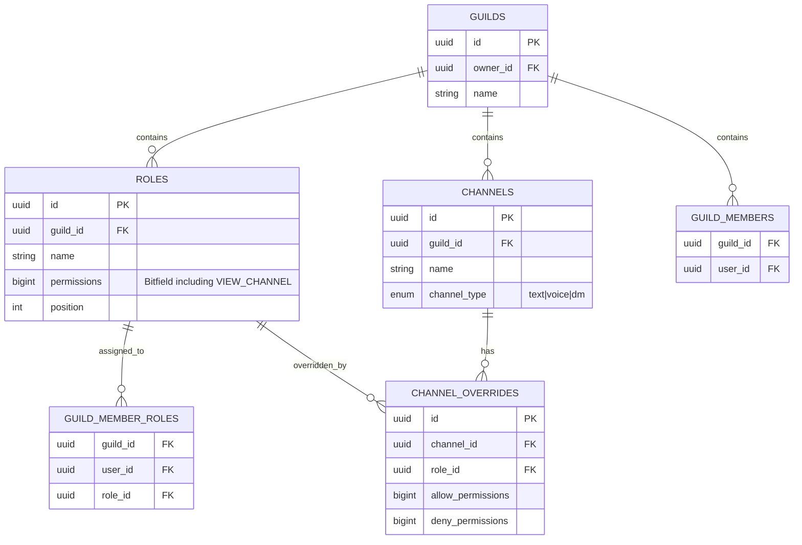
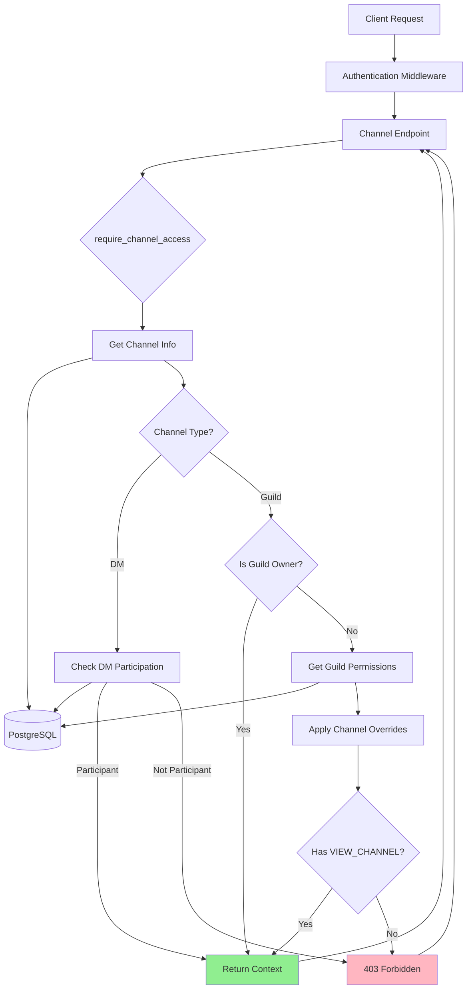
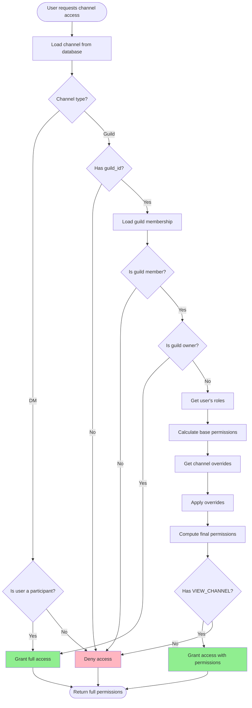
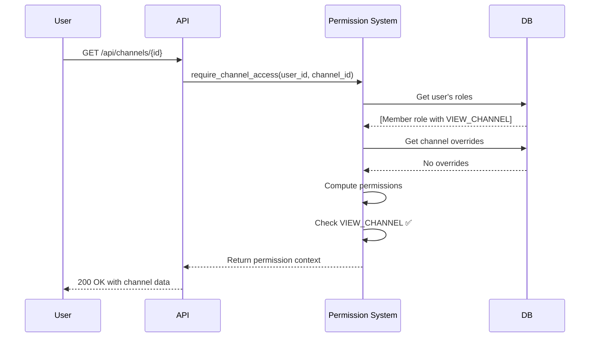
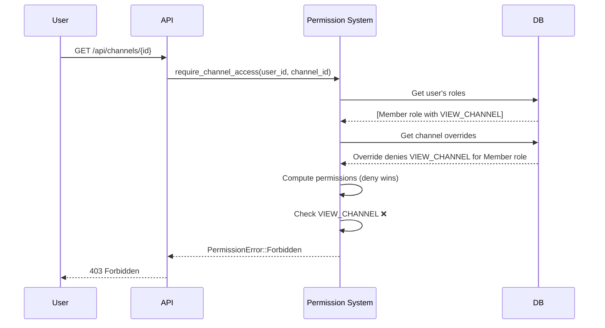
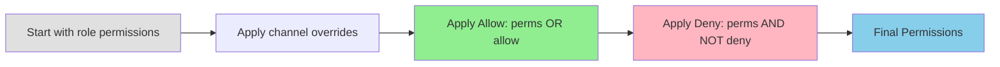
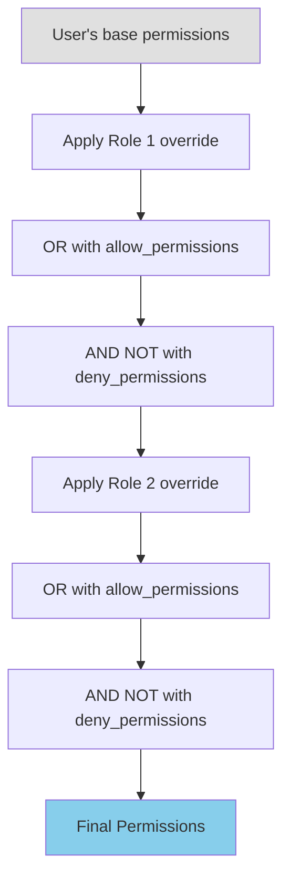
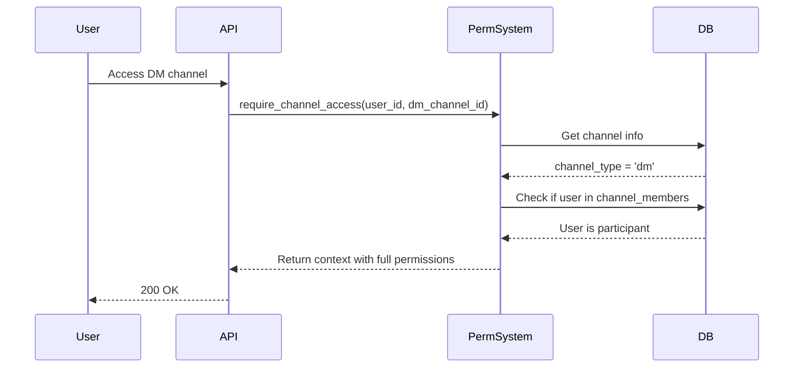

# Channel-Level Permissions System

**Feature:** VIEW_CHANNEL Permission
**Status:** ✅ Implemented
**Version:** Added in v0.x.x (Unreleased)
**Last Updated:** 2026-02-03

---

## Table of Contents

1. [Overview](#overview)
2. [Architecture](#architecture)
3. [Permission Resolution](#permission-resolution)
4. [Channel Overrides](#channel-overrides)
5. [DM vs Guild Channels](#dm-vs-guild-channels)
6. [API Reference](#api-reference)
7. [Security Considerations](#security-considerations)
8. [Migration Guide](#migration-guide)
9. [Testing](#testing)

---

## Overview

The channel-level permissions system provides fine-grained access control for Discord-style channels. At its core, the **VIEW_CHANNEL** permission controls whether a user can see and interact with a specific channel.

### Key Features

- **Guild-level permissions**: Base permissions assigned via roles
- **Channel overrides**: Per-channel allow/deny rules that override role permissions
- **Guild owner bypass**: Guild owners have unrestricted access to all channels
- **DM channel protection**: DM channels are only accessible to participants
- **Deny-wins logic**: Deny permissions always take precedence over allow permissions
- **Backward compatible**: Existing guilds retain full channel access

### Permission Bit

```rust
const VIEW_CHANNEL: i64 = 1 << 24;  // Bit 24 in the 64-bit permission bitfield
```

---

## Architecture

### Database Schema



### System Components



---

## Permission Resolution

### Resolution Algorithm

The permission resolution follows a specific order to determine if a user can access a channel:



### Permission Calculation

**Step 1: Base Permissions**
```rust
// Start with @everyone role permissions
let mut perms = everyone_role.permissions;

// Add permissions from all user's roles (bitwise OR)
for role in user_roles {
    perms |= role.permissions;
}
```

**Step 2: Apply Channel Overrides**
```rust
// For each role the user has
for role in user_roles {
    if let Some(override) = channel_overrides.get(role.id) {
        // First apply allow (bitwise OR)
        perms |= override.allow_permissions;

        // Then apply deny (bitwise AND NOT) - deny wins!
        perms &= !override.deny_permissions;
    }
}
```

**Step 3: Check VIEW_CHANNEL**
```rust
if !perms.contains(VIEW_CHANNEL) {
    return Err(PermissionError::Forbidden);
}
```

### Example Scenarios

#### Scenario 1: User with Role Permission



#### Scenario 2: User Denied by Channel Override



---

## Channel Overrides

Channel overrides allow fine-grained control by allowing or denying specific permissions for specific roles on a per-channel basis.

### Override Logic



### Deny Always Wins

The deny permission is applied AFTER the allow permission, ensuring deny always takes precedence:

```rust
// Step 1: Add allowed permissions
perms |= override.allow_permissions;

// Step 2: Remove denied permissions (overrides step 1)
perms &= !override.deny_permissions;
```

**Example:**
- User has role A (allows VIEW_CHANNEL) and role B (denies VIEW_CHANNEL)
- Channel has override for role A: allow = 0, deny = 0
- Channel has override for role B: allow = 0, deny = VIEW_CHANNEL
- **Result:** User CANNOT view channel (deny wins)

### Multiple Overrides

When a user has multiple roles with overrides:



**Key Point:** All allows are applied first, then all denies. Any deny from any role will block the permission.

---

## DM vs Guild Channels

### Guild Channels

- **Permission checks:** Full permission system with roles and overrides
- **Owner bypass:** Guild owners can access all channels
- **Requires:** Guild membership + VIEW_CHANNEL permission
- **Context returned:** Full `MemberPermissionContext` with computed permissions

### DM Channels

- **Permission checks:** Simple participation check
- **Owner bypass:** N/A (no owner concept)
- **Requires:** User must be a channel participant
- **Context returned:** Minimal context with full permissions

### Comparison Table

| Feature | Guild Channels | DM Channels |
|---------|---------------|-------------|
| Permission checks | ✅ Full system | ❌ Participation only |
| Role-based access | ✅ Yes | ❌ No |
| Channel overrides | ✅ Yes | ❌ No |
| Owner bypass | ✅ Yes | ❌ N/A |
| `channel_type` | `text` or `voice` | `dm` |
| `guild_id` | Required (UUID) | `NULL` |
| Stored in | `channels` table | `channels` table |
| Participants | Via `guild_members` | Via `channel_members` |

### DM Access Flow



---

## API Reference

### Core Function

#### `require_channel_access`

```rust
/// Check if a user can view a specific channel.
///
/// # Arguments
/// * `pool` - Database connection pool
/// * `user_id` - UUID of the user requesting access
/// * `channel_id` - UUID of the channel to access
///
/// # Returns
/// * `Ok(MemberPermissionContext)` - User has VIEW_CHANNEL permission
/// * `Err(PermissionError)` - User lacks permission or doesn't exist
///
/// # Errors
/// * `NotFound` - Channel doesn't exist
/// * `NotGuildMember` - User not in guild
/// * `Forbidden` - User not a DM participant
/// * `MissingPermission(VIEW_CHANNEL)` - User lacks VIEW_CHANNEL
pub async fn require_channel_access(
    pool: &PgPool,
    user_id: Uuid,
    channel_id: Uuid,
) -> Result<MemberPermissionContext, PermissionError>
```

### Protected Endpoints

All endpoints that access channel data now enforce VIEW_CHANNEL permission:

| Endpoint | Additional Permission | Description |
|----------|---------------------|-------------|
| `GET /api/channels/{id}` | None | View channel details |
| `GET /api/channels/{id}/messages` | None | List messages |
| `POST /api/channels/{id}/messages` | SEND_MESSAGES | Send message |
| `PATCH /messages/{id}` | None (own message) | Edit own message |
| `DELETE /messages/{id}` | None (own message) | Delete own message |
| `POST /api/channels/{id}/messages/{mid}/reactions` | None | Add reaction |
| `DELETE /api/channels/{id}/messages/{mid}/reactions` | None | Remove reaction |
| `PATCH /api/channels/{id}` | MANAGE_CHANNELS | Update channel |
| `DELETE /api/channels/{id}` | MANAGE_CHANNELS | Delete channel |
| `GET /api/channels/{id}/overrides` | MANAGE_CHANNELS | List overrides |
| `POST /api/channels/{id}/overrides` | MANAGE_CHANNELS | Create override |
| `DELETE /api/channels/{id}/overrides/{rid}` | MANAGE_CHANNELS | Delete override |
| `POST /api/guilds/{id}/search` | None | Search messages (filtered) |
| `GET /api/guilds/{id}/channels` | None | List channels (filtered) |
| `POST /api/me/favorites/{channel_id}` | None | Favorite channel |
| WebSocket: `Typing` | None | Send typing indicator |
| WebSocket: `VoiceJoin` | VOICE_CONNECT | Join voice channel |
| WebSocket: `ScreenShareStart` | SCREEN_SHARE | Start screen share |

### Permission Context Structure

```rust
pub struct MemberPermissionContext {
    /// Guild owner ID (for bypass checks)
    pub guild_owner_id: Uuid,

    /// @everyone role permissions
    pub everyone_permissions: GuildPermissions,

    /// User's roles with permissions
    pub member_roles: Vec<MemberRole>,

    /// Final computed permissions (includes channel overrides)
    pub computed_permissions: GuildPermissions,

    /// Highest role position (for permission hierarchy)
    pub highest_role_position: Option<i32>,

    /// Whether user is the guild owner
    pub is_owner: bool,
}
```

---

## Security Considerations

### Information Disclosure Prevention

**Generic Error Messages:**
All permission failures return generic errors to prevent information leakage:

```rust
// ❌ BAD: Leaks which permission is missing
return Err(Error::MissingPermission("VIEW_CHANNEL"));

// ✅ GOOD: Generic forbidden error
return Err(Error::Forbidden);
```

**Channel List Filtering:**
When listing channels, inaccessible channels are silently filtered instead of erroring:

```rust
// ✅ User sees only channels they can view
let accessible_channels = all_channels
    .into_iter()
    .filter(|ch| has_view_channel(user, ch))
    .collect();
```

### Attack Vectors Prevented

1. **Channel enumeration:** Generic errors prevent discovering channel existence
2. **Permission probing:** No distinction between "channel not found" and "no permission"
3. **Favorite bypass:** Fixed in v0.x.x - favorites now check VIEW_CHANNEL
4. **WebSocket leakage:** Messages from hidden channels are filtered before delivery
5. **Search bypass:** Search only includes accessible channels

### Security Best Practices

```rust
// ✅ Always check VIEW_CHANNEL first
let ctx = require_channel_access(&pool, user_id, channel_id).await?;

// ✅ Then check additional permissions
if !ctx.has_permission(SEND_MESSAGES) {
    return Err(Error::Forbidden);
}

// ✅ Use the returned context for subsequent checks
// (it contains channel-specific permissions with overrides applied)
```

---

## Migration Guide

### Backward Compatibility

The VIEW_CHANNEL system is **fully backward compatible**. The database migration automatically adds VIEW_CHANNEL to all existing roles:

```sql
-- Migration: 20260203000000_add_view_channel_permission.sql
UPDATE roles
SET permissions = permissions | (1::bigint << 24)
WHERE guild_id IS NOT NULL;
```

**Result:** All existing users retain their current channel access.

### Enabling Restricted Channels

To create a channel that only certain roles can see:

#### Step 1: Remove VIEW_CHANNEL from @everyone

```http
PATCH /api/guilds/{guild_id}/roles/{everyone_role_id}
{
  "permissions": 0  // Remove all permissions including VIEW_CHANNEL
}
```

#### Step 2: Create Channel Override for Specific Roles

```http
POST /api/channels/{channel_id}/overrides
{
  "role_id": "{member_role_id}",
  "allow_permissions": 16777216,  // VIEW_CHANNEL bit (1 << 24)
  "deny_permissions": 0
}
```

### New Guild Defaults

For new guilds, the default @everyone role should include VIEW_CHANNEL:

```rust
const DEFAULT_EVERYONE_PERMISSIONS: i64 =
    VIEW_CHANNEL |
    SEND_MESSAGES |
    READ_MESSAGE_HISTORY;
```

---

## Testing

### Integration Tests

Located in: `server/tests/permissions/channel_permissions.rs`

**Test Categories:**

1. **Guild Owner Bypass** (2 tests)
   - Owner can view any channel
   - Owner bypasses channel overrides

2. **VIEW_CHANNEL Permission** (3 tests)
   - User with permission can access
   - User without permission cannot access
   - Non-guild members cannot access

3. **Channel Overrides** (3 tests)
   - Deny blocks access
   - Allow grants access
   - Deny wins over allow

4. **DM Channels** (2 tests)
   - Participants can access
   - Non-participants cannot access

5. **Message Operations** (2 tests)
   - Cannot send without VIEW_CHANNEL
   - Cannot read without VIEW_CHANNEL

6. **Security Fixes** (2 tests)
   - Cannot favorite without VIEW_CHANNEL
   - Can favorite with VIEW_CHANNEL

### Running Tests

```bash
# Run all permission tests
cargo test --test channel_permissions

# Run with output
cargo test --test channel_permissions -- --nocapture

# Run specific test
cargo test test_channel_override_deny_wins_over_allow
```

### Manual Testing Checklist

- [ ] Create guild with multiple channels
- [ ] Create role without VIEW_CHANNEL permission
- [ ] Assign role to test user
- [ ] Verify user cannot see channels in channel list
- [ ] Verify user cannot send messages to hidden channels
- [ ] Verify user cannot read message history of hidden channels
- [ ] Create channel override (allow VIEW_CHANNEL for specific user)
- [ ] Verify user can now access that specific channel
- [ ] Verify search only returns results from accessible channels
- [ ] Verify WebSocket doesn't deliver messages from hidden channels
- [ ] Verify guild owner can access all channels regardless of overrides

---

## Appendix

### Permission Bit Reference

```rust
// Guild Permissions (from server/src/permissions/guild.rs)
const CREATE_INVITE:        i64 = 1 << 0;  // 1
const KICK_MEMBERS:         i64 = 1 << 1;  // 2
const BAN_MEMBERS:          i64 = 1 << 2;  // 4
const SEND_MESSAGES:        i64 = 1 << 3;  // 8
const MANAGE_CHANNELS:      i64 = 1 << 4;  // 16
const MANAGE_GUILD:         i64 = 1 << 5;  // 32
const MANAGE_ROLES:         i64 = 1 << 6;  // 64
const MANAGE_MESSAGES:      i64 = 1 << 7;  // 128
const READ_MESSAGE_HISTORY: i64 = 1 << 8;  // 256
const MENTION_EVERYONE:     i64 = 1 << 9;  // 512
const VOICE_CONNECT:        i64 = 1 << 10; // 1024
const VOICE_SPEAK:          i64 = 1 << 11; // 2048
const VOICE_MUTE_MEMBERS:   i64 = 1 << 12; // 4096
const VOICE_DEAFEN_MEMBERS: i64 = 1 << 13; // 8192
const VOICE_MOVE_MEMBERS:   i64 = 1 << 14; // 16384
const SCREEN_SHARE:         i64 = 1 << 15; // 32768
const VIEW_CHANNEL:         i64 = 1 << 24; // 16777216 ⭐ NEW
```

### Related Documentation

- [Permission System Overview](./permissions-overview.md)
- [Guild Roles and Permissions](./guild-roles.md)
- [Security Architecture](../security/architecture.md)
- [API Authentication](../api/authentication.md)

---

**Document Version:** 1.0
**Last Reviewed:** 2026-02-03
**Authors:** VoiceChat Team
