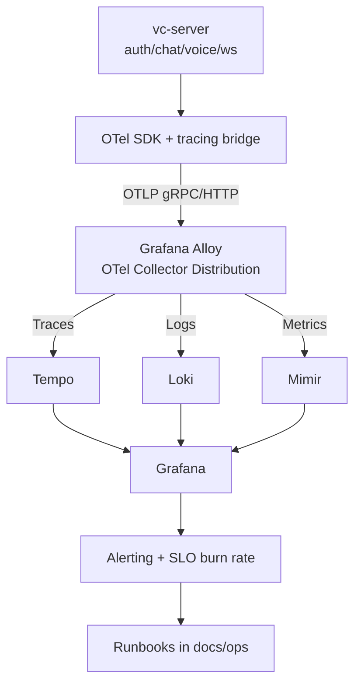
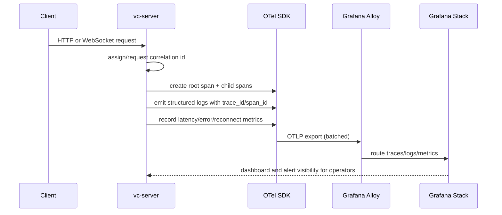
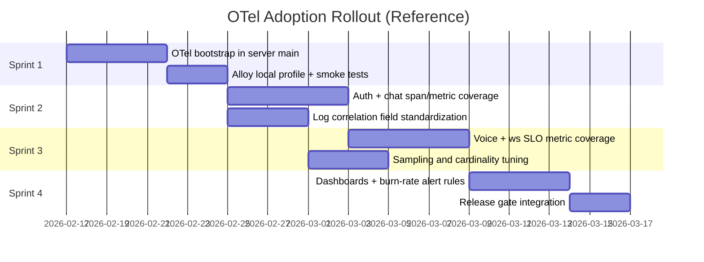

# OpenTelemetry and Grafana Reference Architecture - Design

**Date:** 2026-02-15
**Status:** Draft (Reference)
**Roadmap Item:** SRE foundations (SLOs, observability standards, alerting, incident playbooks)

## Problem

The server already uses structured `tracing` logs, but metrics, logging, and tracing are not yet unified under one standards-based observability architecture. We need a durable approach that supports self-hosted and future SaaS operation without backend lock-in.

## Goals

- Adopt proven open standards for telemetry collection and propagation.
- Correlate metrics, logs, and traces across auth/chat/voice/ws critical paths.
- Keep observability backend vendor-neutral while providing a Grafana+Alloy reference target.
- Define rollout phases that protect performance targets (especially voice latency).

## Non-Goals

- Committing to a single observability vendor forever.
- Tracing per audio packet or high-cardinality event streams.
- Shipping full client-side OTel from day one.

## Standards Profile

- **Trace propagation:** W3C Trace Context (`traceparent`, `tracestate`) and W3C Baggage.
- **Telemetry transport:** OTLP/gRPC as default, OTLP/HTTP as fallback.
- **Semantic conventions:** OpenTelemetry semantic conventions for HTTP, DB, messaging/realtime where applicable.
- **Metrics format compatibility:** OpenMetrics/Prometheus compatibility via collector exporters.
- **Log model:** Structured JSON logs with trace and span correlation fields.

## Design Options

### Option A: Direct app exporters to backend

**Pros:**
- Lower initial component count.
- Fast local proof-of-concept.

**Cons:**
- Harder to enforce redaction/sampling centrally.
- Tighter coupling between app and chosen backend.
- More rollout risk for configuration mistakes.

### Option B: Collector-first architecture with Grafana Alloy (chosen)

**Pros:**
- Central place for sampling, redaction, routing, retries, and policy.
- Clear separation between instrumentation and backend.
- Easier self-hosted and SaaS deployment variants.

**Cons:**
- One extra runtime component to operate.
- Requires collector config lifecycle management.

## Chosen Approach

Use OpenTelemetry SDK instrumentation in server code, export OTLP to Grafana Alloy (OpenTelemetry Collector distribution), and route data from Alloy to the reference Grafana stack (Grafana + Alloy + Mimir + Loki + Tempo) or alternative backends.

### Current baseline alignment

- Existing server logging initialization in `server/src/main.rs` already uses JSON `tracing_subscriber` with env filtering.
- `tracing` instrumentation is broadly present across modules (`auth`, `chat`, `voice`, `ws`, and more).
- No OTel crates are currently configured in workspace dependencies.

### Reference backend (future, optional)

For future operations reference, use these components together:
- **Grafana Alloy** as OTLP collector/processor/forwarder
- **Tempo** for traces
- **Loki** for logs
- **Mimir** for metrics
- **Grafana** for dashboards and alerting UX

This remains a reference architecture only; OTLP keeps backend choices open.

## Telemetry Architecture

## Correlation Flow

## Rust Wiring Plan (Reference)

### Workspace dependency additions (`Cargo.toml`)

- `opentelemetry`
- `opentelemetry_sdk`
- `opentelemetry-otlp`
- `tracing-opentelemetry`

### Server bootstrap wiring (`server/src/main.rs`)

1. Build OTLP exporter configuration from env.
2. Initialize OTel tracer and meter providers.
3. Register `tracing_subscriber` layers:
   - JSON log formatting layer
   - Env filter layer
   - OpenTelemetry tracing layer
4. Add graceful shutdown flush for telemetry exporters.

### Domain instrumentation targets

- `server/src/auth/` for login/session/token flows
- `server/src/chat/` for message and attachment paths
- `server/src/voice/` for connect/reconnect and stream quality aggregates
- `server/src/ws/` for connection lifecycle and delivery freshness

## Metrics, Logs, and Traces Contract

### Metrics (SLO-focused)

- API latency p95/p99 and error rate by domain.
- WebSocket reconnect success rate and message freshness.
- Voice session setup success and quality aggregates.
- Exporter health (`dropped`, `queue_size`, `export_failures`).

### Logs (forensics and audit)

- Structured JSON only.
- Required fields: `timestamp`, `level`, `service`, `domain`, `trace_id`, `span_id`, `request_id`, `event`, `outcome`.
- Security/audit events must include actor and policy context (sanitized).

### Traces (causal debugging)

- Root span per inbound HTTP request or WS session event.
- Child spans for DB, Redis, external service, and key business operations.
- No high-volume packet-level tracing in voice hot paths.

## Alloy Pipeline Policy (Collector)

- **Receivers:** OTLP (gRPC + HTTP).
- **Processors:** memory limiter, batch, attribute redaction, probabilistic sampling.
- **Exporters:** OTLP or native backends for Tempo/Loki/Mimir.
- **Reliability:** bounded queues, retry with backoff, fail-open behavior for app runtime.

## Security and Privacy Constraints

- Never emit credentials, token contents, or sensitive payloads.
- Apply field allowlist for log attributes from auth and moderation domains.
- Restrict telemetry backend access via RBAC.
- Preserve audit trails for Alloy pipeline and alert-rule changes.

## Performance Constraints

- Keep synchronous instrumentation out of request hot paths.
- Use async/batched export only.
- Enforce cardinality budgets on labels.
- Start with conservative sampling and increase only when justified.
- Benchmark overhead against platform targets (<50ms voice latency, low idle footprint).

## Rollout Plan by Sprint

## Validation Strategy

- Unit/integration tests continue as baseline quality gate.
- Add telemetry smoke tests to verify:
  - trace propagation fields present,
  - log-trace correlation fields present,
  - key SLO metrics emitted.
- Add staging checks for Alloy connectivity and exporter health.
- Block release promotion when Alloy health or SLO telemetry is degraded.

## Open Questions

- Should tenant/guild identifiers be included in telemetry labels or logs only?
- Which metric retention windows are required for self-hosted vs SaaS modes?
- Do we run one Alloy instance per node or a centralized Alloy tier first?

## References

- `docs/plans/2026-02-15-sre-foundations-design.md`
- `docs/plans/2026-02-15-operational-safety-implementation-plan.md`
- `docs/project/roadmap.md`
- `server/src/main.rs`
- `server/Cargo.toml`
- `Cargo.toml`
