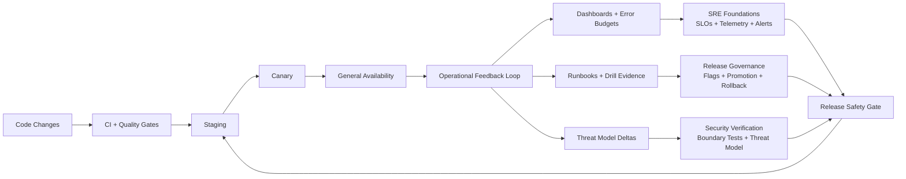
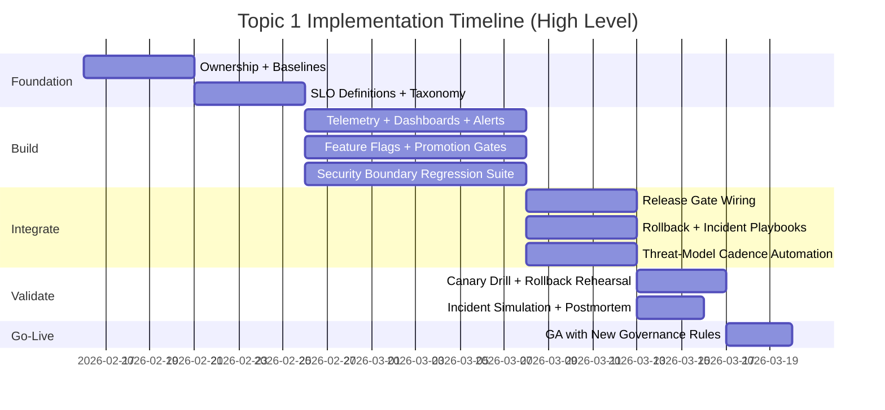
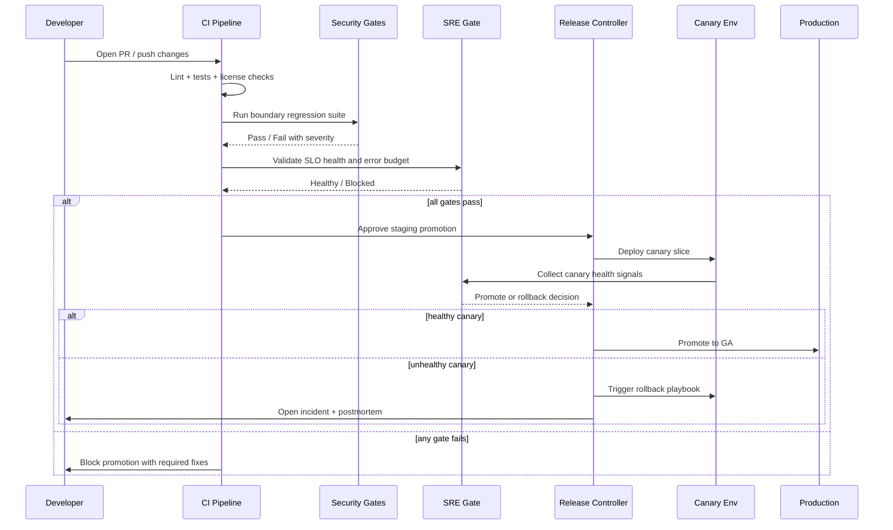

# Operational Safety Program - Implementation Plan

**Date:** 2026-02-15
**Status:** Draft
**Scope:** Topic 1 from roadmap priority sequence (SRE Foundations + Release Governance + Security Verification Cadence)
**Design Inputs:**
- `docs/plans/2026-02-15-sre-foundations-design.md`
- `docs/plans/2026-02-15-release-governance-design.md`
- `docs/plans/2026-02-15-security-verification-cadence-design.md`
- `docs/plans/2026-02-15-opentelemetry-grafana-reference-design.md`

---

## 1. Objective

Create one implementation program that makes releases both reliable and safe by combining:

1. SLO-based reliability operations
2. Controlled release governance (flags + staged rollout + rollback)
3. Continuous security verification (boundary regression + threat-model cadence)

The outcome is a single release safety envelope for server, web client, and Tauri client.

---

## 2. High-Level Architecture

### Program principle

- A release is promotable only when reliability signals, governance checks, and security checks all pass.

---

## 3. Delivery Strategy and Milestones

---

## 4. Workstreams

## WS-A: SRE Foundations

### Deliverables

- SLO document set for auth/chat/voice/ws critical journeys.
- Telemetry standard (metric names, labels, cardinality rules).
- Dashboards for p95 latency, error rate, reconnect success, voice quality.
- Burn-rate alerts mapped to runbooks.

### Primary implementation targets

- `server/src/auth/`
- `server/src/chat/`
- `server/src/voice/`
- `server/src/ws/`
- `infra/monitoring/` (new)
- `docs/ops/` (runbooks)

---

## WS-B: Release Governance

### Deliverables

- Typed feature flag model with owner, expiry, fallback, kill-switch semantics.
- Promotion flow: local -> staging -> canary -> GA.
- Mandatory evidence checklist for stage promotion.
- Domain rollback playbooks and rehearsed rollback procedure.

### Primary implementation targets

- `server/src/config.rs` (or new flag config module under `server/src/config/`)
- `client/src/stores/` or `client/src/lib/` for client-side flag consumption
- `.github/workflows/ci.yml`
- `.github/workflows/release.yml`
- `docs/ops/` (release + rollback playbooks)

---

## WS-C: Security Verification Cadence

### Deliverables

- Threat-model docs per domain with owner and cadence.
- Boundary regression tests for authz/isolation paths.
- Release security checklist and waiver workflow.
- Quarterly deep-check routine and annual external test preparation.

### Primary implementation targets

- `docs/security/` (threat models + cadence index)
- `server/tests/channel_permissions_test.rs`
- `server/tests/uploads_http_test.rs`
- `server/tests/websocket_integration_test.rs`
- `server/tests/auth_test.rs`
- `.github/workflows/security.yml`
- `.github/workflows/ci.yml`

---

## 5. End-to-End Release Flow (Target State)

---

## 6. Detailed Implementation Backlog

### Phase 1 - Baseline and ownership

1. Create program charter and ownership matrix for auth/chat/voice/ws.
2. Define shared severity taxonomy (Sev1-Sev4) and escalation policy.
3. Define SLO list and budget policy per critical journey.
4. Define security waiver policy (who can approve, expiry, audit requirements).

### Phase 2 - Build core controls

1. Add telemetry instrumentation for agreed SLO indicators.
2. Create monitoring dashboards and burn-rate alerts.
3. Implement typed feature flags and kill-switch flow.
4. Create staged promotion checklist and evidence template.
5. Implement boundary regression test pack in `server/tests/`.
6. Add threat-model templates and domain documents under `docs/security/`.

### Phase 3 - Integrate into release process

1. Wire SLO health + security checks into CI merge/release gates.
2. Add canary promotion decision step in release workflow.
3. Add rollback automation hooks and rollback evidence recording.
4. Add release security checklist + waiver registry.

### Phase 4 - Operate and harden

1. Run canary and rollback rehearsal.
2. Run incident simulation and postmortem.
3. Tune alert thresholds to reduce noise.
4. Finalize monthly (ops) and quarterly (security) cadence calendars.

---

## 7. Proposed Repository Changes (Planning Level)

| Area | Planned changes |
|---|---|
| `docs/ops/` | Add `slo-catalog.md`, `incident-runbook.md`, `rollback-playbook-template.md`, `release-promotion-checklist.md` |
| `docs/security/` | Add `threat-model-index.md`, domain threat models, `waiver-policy.md` |
| `.github/workflows/ci.yml` | Add merge gates for critical security regression suite and SLO health checks |
| `.github/workflows/release.yml` | Add canary promotion and rollback decision stage |
| `.github/workflows/security.yml` | Add cadence checks and policy compliance validation |
| `infra/monitoring/` | Add dashboard definitions + alert policy files |
| `server/src/*` | Add telemetry signals for auth/chat/voice/ws critical paths |
| `server/tests/` | Expand boundary regression coverage for authz/isolation scenarios |
| `client/src/` | Add client-safe feature flag consumption for staged rollout controls |

---

## 8. Verification Strategy

### Mandatory checks per PR

- Existing quality gates in CI (lint, tests, license checks).
- Critical security boundary regression tests.
- No new high-cardinality telemetry labels.

### Mandatory checks per release candidate

- SLO health above release threshold for defined lookback window.
- Canary health pass with no Sev1/Sev2 regression.
- Security checklist complete (or explicit, approved waiver).
- Rollback drill evidence available and not stale.

### Program-level recurring checks

- Monthly error budget review.
- Monthly incident/runbook review.
- Quarterly threat-model delta review.
- Annual external security test planning kickoff.

---

## 9. Risks and Mitigations

| Risk | Impact | Mitigation |
|---|---|---|
| Alert noise from poor thresholds | Ops fatigue, ignored incidents | Start conservative, tune after rehearsal, use burn-rate patterns |
| Slow PR cycle due to heavy security tests | Dev velocity drop | Keep critical suite in PR, move heavy exhaustive suites to nightly |
| Flag sprawl and stale toggles | Complexity and hidden behavior | Enforce flag owner + expiry + cleanup review each release |
| Canary scope too small/too large | False confidence or high blast radius | Define canary cohort policy and evolve with measured outcomes |
| Unclear waiver process | Security governance bypass | Central waiver registry with approver identity and hard expiry |

---

## 10. Definition of Done

Topic 1 is complete when all of the following are true:

1. SLOs, dashboards, and burn-rate alerts are active for critical paths.
2. Release flow includes staged promotion and rollback decision points.
3. High-risk features can be kill-switched via typed feature flags.
4. Boundary regression suite blocks releases on high-severity failures.
5. Threat-model and security checklist cadence is operational.
6. At least one full canary+rollback drill and one incident simulation are documented.

---

## 11. Mermaid Diagram Index

1. Section 2: Program architecture (`graph LR`)
2. Section 3: Timeline (`gantt`)
3. Section 5: Release flow (`sequenceDiagram`)
